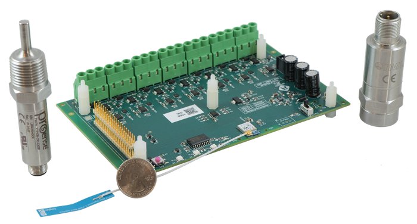
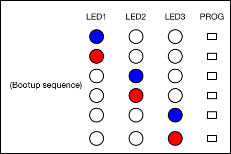
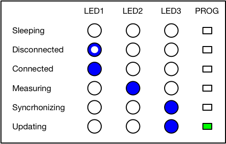
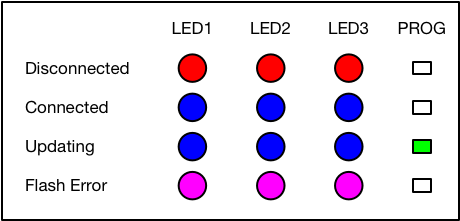

# Avimesa 1000 User Guide

## Introduction
This project contains a user guide for the Avimesa 1000.  Designed to connect with industrial 4-20 mA sensors, the Avimesa 1000 is an intelligent I/O device which provides connectivity to the Avimesa Device Cloud. The system has a highly power-efficient and capable Cortex M4F processor that manages communication, measurement scheduling, sensor interface power control, and filtering of sensor data. The firmware is power-optimized, allowing for the use of battery power where needed.

## Table of Contents
- [1. Overview](#1.-overview)
- [2. Quick Start](#2.-quick-start)
- [3. Power Supply / Sensor Power](#3.-power-supply-sensor-power)
    - [3.1 Ratings](#3.1-power-supply-sensor-power-ratings)
    - [3.2 Installation](#3.2-power-supply-sensor-power-installation)
    - [3.3 Sensor Power Information](#3.3-power-supply-sensor-power-info)
- [4. Antenna Information](#4.-antenna-information)
    - [4.1 Certified Antennas](#4.1-antenna-information-certified)
    - [4.2 Installation](#4.2-antenna-information-installation)
- [5. Device Modes](#5.-device-modes)
    - [5.1 LED Test Mode](#5.1-device-modes-led-test)
    - [5.2 Run Mode](#5.2-device-modes-run-mode)
    - [5.3 Service Mode](#5.3-device-modes-service-mode)
    - [5.4 Firmware Update Mode](#5.4-device-modes-fw-update-mode)
- [6. LED Status Codes](#6.-led-status-codes)
    - [6.1 LED Test Mode](#6.1-led-status-codes-led-test)
    - [6.2 Run Mode](#6.2-led-status-codes-run-mode)
    - [6.3 Service Mode](#6.3-led-status-codes-service-mode)
    - [6.4 Firmware Update Mode](#6.4-led-status-codes-fw-update-mode)
- [7. Sensor Connection](#7.-sensor-conn)
    - [7.1 Pinout](#7.1-sensor-conn-pinout)
    - [7.2 Shielded Cables](#7.2-sensor-conn-shield)
- [8. Device Configuration](#8.-device-config)

## 1. Overview
Figure 1 calls out the main components that are used in this guide:

A. Power Switch 
B. NFC Header (for future use) 
C. Antenna Connector (type U.FL) 
D. Programming LED 
E. LEDs 1-3 (left to right) 
F. Reset Button 
G. Power Connector 
H. Analog Channels 1-7 (left to right) 
I. Avimesa Header (GPIO channels 9-17) 
J. Shield Solder Point 

 
*Figure 1*

[//]: # (This may be the most platform independent comment)

[Top](#toc) 

## 2. Quick Start

The following assumes that the Avimesa Gateway is configured and running.  Please see https://github.com/Avimesa/user-guide-avimesa-gateway for help on setting up the Avimesa Gateway.

1. Attach the antenna to the `Antenna Connector` (Figure 1-C)
2. Attach power to the `Power Connector` (Figure 1-G)
3. Attach a 4-20 mA sensors to `Analog Channels 1-7` (Figure 1-H)
4. Slide the `Power Switch` to the 'ON' position (Figure 1-A) 

At this point, the Avimesa 1000 will proceed to take measurements and communicate with the Avimesa Device Cloud.  The Avimesa Toolkit can be used to view device data and setup the Device Driver Script and device configuration.

If more details are required, please refer to the sections that follow.

[Top](#toc) 

## 3. Power Supply / Sensor Power

## 3.1 Rating

Table 1 lists the power supply ratings.  A battery can be used or a DC power supply.  

| Condition | Voltage |
| --- | --- |
| Recommended | 12-24 VDC |
| Maximum | 27.5 VDC |
| Minimum | 5.0 VDC (silkscreen shows 10.5, but 5.0 is OK ;) |
*Table 1*

**It should be noted that the sensors are powered directly from the input voltage (minus a diode drop ~0.7 VDC)**.

This feature provides flexibility in 4-2 mA sensor selection.

## 3.2 Installation

Attach the power supply connector to the `Power Connector` (Figure 1-G).

An example of the connector required and included in the kit is **PN: TODO**.

## 3.3 Sensor Power Information

The sensors, when powered programmatically, will be supplied by the same voltage as the input voltage, minus a diode drop of roughly ~0.7 VDC.  The digital section of the board is supplied via a 3.3 VDC source for reference. 

[Top](#toc) 

## 4. Antenna Information

### 4.1 Certified Antennas
The Avimesa 1000 is certified with five (5) antennas in the following regions using the Rigado BGM-301 module:

- USA (FCC certification)
- Canada (IC certification)
- Europe (CE report)
- Japan (MIC certification)
- Australia & New Zealand (RCM report)

The following antennas are all approved for use with the Avimesa 1000:

- Pulse W1030 2 dBi 1/4 Wave Dipole – Whip Length: 108.3mm
- Taoglas FXP73.07.0100A 2.5dBi 1/4 Wave Dipole – Flex 7mm x 47mm x 0.1mm
- Pulse W1027 3.2 dBi 1/4 Wave Dipole – Whip Length: 136.8mm
- Kinsun 6670113050-145 2.0 dBi 1/4 Wave Dipole – PCB 12mm x 65mm x 0.46mm
- Kinsun 6610103081 5.0 dBi 1/2 Wave Dipole – Whip Length: 196.6mm

### 4.1 Installation

Simply click the antenna to the `Antenna Connector` (Figure 1-C)

[Top](#toc) 

## 5. Device Modes

### 5.1 LED Test Mode
Upon boot up or soft reset, the device will run through an `LED Test Mode`.  This mode is provided to ensure the LEDs are operational, and to provide the user a window of time to put the device into service mode if needed.

### 5.2 Run Mode
After boot up, the normal state of the device is `Run Mode`.  In the mode, the device will perform measurements and synchronize with the Avimesa Device Cloud based upon it's configuration.  The configuration is setup via the Avimesa Toolkit and is described in section **TODO**.

### 5.3 Service Mode
When the device isn't configured it will boot up into `Service Mode`.  The device can also be manually forced into 'service mode' through the following sequence.

1. Soft reset the device by momentarily pressing the `Reset` button (Figure 1-C)
2. Immediately after the device resets (before the device transitions to `Run Mode`), press the `Reset` button (Figure 1-C)

### 5.4 Firmware Update Mode
When the device is in firmware update mode, no other functionality is available.  The device will reset automatically after the firmware update completes and resume normal operation.

If the firmware update is interrupted, the device will revert the currently running firmware.

[Top](#toc) 

## 6. LED Status Codes

### 6.1 LED Test Mode
In this mode, the device will cycle through each of the LEDs (1-3) and LED colors (red/blue). 

 
*Figure 2*

### 6.2 Run Mode
When in this mode, in general the LEDs represent the following:

- LED1 - Gateway Connection
- LED2 - Measurement in Progress
- LED3 - Device Cloud Connection Status
- PROG LED - Program LED

These states are represented by LEDs 1-3 using the following:

 
*Figure 3*

The same information in text form:

| State         | LED1 Red | LED1 Blue      | LED2 Red | LED2 Blue | LED3 Red | LED3 Blue | PROG LED Green      |
| ---           | ---      | ---            | ---      | ---       | ---      | ---       | ---                 |
| Disconnected  | Off      | **Fast Blink** | Off      | Off       | Off      | Off       | Off                 |
| Connected     | Off      | **On**         | Off      | Off       | Off      | Off       | Off                 |
| Measuring     | Off      | Off            | Off      | **On**    | Off      | Off       | Off                 |
| Synchronizing | Off      | Off            | Off      | Off       | Off      | **On**    | Off                 |
| Updating      | Off      | Off            | Off      | Off       | Off      | **On**    | **Possible Blinks** |
*Table 2*

### 6.3 Service Mode
When in this mode, the state are represented by LEDs 1-3 using the following:

 
*Figure 4*

The same information in text form:

| State         | LED1 Red | LED1 Blue | LED2 Red | LED2 Blue | LED3 Red | LED3 Blue | PROG LED Green |
| ---           | ---      | ---       | ---      | ---       | ---      | ---       | ---            |
| Disconnected  | **On**   | Off       | **On**   | Off       | **On**   | Off       | Off            |
| Connected     | Off      | **On**    | Off      | **On**    | Off      | **On**    | Off            |
| Updating      | Off      | **On**    | Off      | **On**    | Off      | **On**    | **Possible Blinks** |
| Flash Error   | **On**   | **On**    |  **On**  | **On**    | **On**   | **On**    | Off            |
*Table 3*

### 6.4 Firmware Update Mode

**TODO**

[Top](#toc) 

## 7. Sensor Connection

### 7.1 Pinout
`Analog Channels 1-7` (Figure 1-H) have a screw terminal connection with the following pinout:

| 1 | 2 | 3 | 
| --- | --- | --- |
| Shield (optional) | Sensor Power | Signal Return |

If looking at `Analog Channels 1-7` (Figure 1-H), pin 1 is on the left side.

### 7.2 Shielded Cables
Although noise resistant by design, if using a shielded cable, you can solder an earth ground to the `Shield Solder Point` (Figure 1-J).

[Top](#toc) 

## 8. Device Configuration
**TODO**

[Top](#toc) 